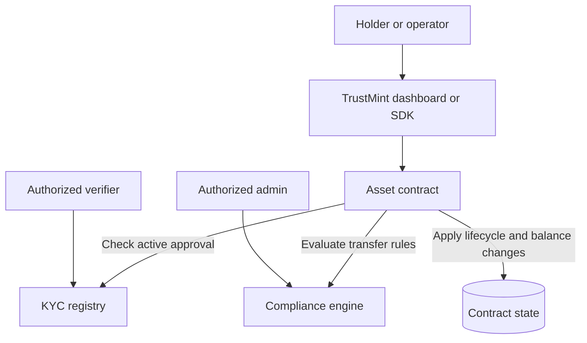

<p align="center">
  
</p>

<p align="center">
  <strong>Real assets. Clear rules. Stellar Soroban.</strong>
  <br />
  Reusable Soroban contracts, asset lifecycle examples, and a wallet-connected dashboard.
</p>

<p align="center">
  <a href="https://github.com/zeemscript/TrustMint/actions/workflows/ci.yml"></a>
  <a href="LICENSE"></a>
  
</p>

TrustMint is an open-source starter kit for exploring tokenized invoices, property shares, and carbon credits on Stellar. Its Soroban contracts pair asset-specific lifecycle examples with on-chain KYC checks and configurable transfer controls.

> **Project status:** TrustMint is an early-stage starter kit. The contracts and dashboard are examples for development and evaluation; the project has not had an independent security audit. Review the code and obtain appropriate legal and security advice before using it with real assets or funds.

## Why TrustMint

Real-world asset products need more than a token balance. They also need clear holder eligibility, transfer controls, and asset-specific rules. TrustMint brings those concerns into one open-source codebase so builders can inspect, adapt, and test a starting point on Stellar instead of wiring every example from scratch.

TrustMint does not perform identity verification itself. Trusted verifiers record approval status on-chain; private identity documents and the underlying compliance process remain off-chain and the responsibility of the deploying project.

## What’s in the repository

| Module | What it demonstrates |
|---|---|
| `kyc-registry` | Verifier administration and holder records with approval status, tier, jurisdiction, and optional expiry. |
| `compliance-engine` | Configurable transfer checks, including pause, address and jurisdiction blocklists, transfer limits, holding periods, and holder caps. |
| `rwa-token` | A SEP-41-style reference token with KYC and compliance hooks plus RWA metadata. It is a separate reference contract; the asset examples below implement their own token logic. |
| `invoice-token` | Invoice metadata and issuance, transfer, settlement, and redemption workflows. |
| `property-token` | Fractional property shares and cumulative per-share dividend accounting. |
| `carbon-credit-token` | Credit issuance, transfer, and retirement records with beneficiary metadata. |

The repository also includes a React + Vite dashboard, a TypeScript SDK, deployment helpers, Rust contract tests, and a local Stellar integration-test setup.

## How compliance checks fit together



Asset contracts call the registry and compliance engine as part of relevant operations. The exact checks depend on the asset contract and method. A successful KYC record only reflects an on-chain verifier decision; it is not proof that an off-chain identity process is adequate or legally compliant.

## Get started

### Prerequisites

- Rust and the `wasm32-unknown-unknown` target
- Stellar CLI
- Node.js 20 or newer
- A Stellar testnet account for deployment

### Build the contracts

```bash
rustup target add wasm32-unknown-unknown
cargo build --release --target wasm32-unknown-unknown
cargo test --features testutils
```

### Deploy the starter suite to testnet

The deployment script deploys the KYC registry, compliance engine, and the three asset contracts. It writes their contract IDs to `frontend/.env`. It does not deploy the separate `rwa-token` reference contract.

```bash
bash scripts/setup-identity.sh trustmint-dev
bash scripts/deploy.sh trustmint-dev
```

The deploy script uses placeholder asset metadata. Review `scripts/deploy.sh` and replace those values before deploying any asset contract, even on testnet.

### Start the dashboard

```bash
cd frontend
npm install
npm run dev
```

The dashboard can be configured with contract IDs in `frontend/.env`. The current deployment script generates the IDs for its five-contract starter deployment. Do not put secrets or private identity data in Vite environment variables; values prefixed with `VITE_` are included in the browser bundle.

## Developer commands

```bash
# Rust formatting and lint checks
cargo fmt --all -- --check
cargo clippy --all --all-targets -- -D warnings

# Contract unit tests
cargo test --features testutils

# Build the TypeScript SDK
npm run build:sdk

# Frontend checks
cd frontend
npm run lint
npm run build
```

The GitHub Actions workflows define the project’s automated checks, including a local Stellar integration job. A green CI run is useful feedback, not a security audit or guarantee of production readiness.

## Repository map

```text
contracts/       Soroban contracts and unit tests
frontend/        React dashboard, wallet integration, and contract clients
sdk/             TypeScript clients for application developers
scripts/         Testnet identity, deployment, and deployment verification helpers
tests/integration/ Local Stellar integration tests
docs/            Deployment and operations guidance
```

## Roadmap

- Complete SEP-41 compatibility verification for the reference token
- Improve deployment and operator tooling
- Expand integration coverage across all asset lifecycles
- Publish and document the TypeScript SDK for external consumers
- Arrange an independent Soroban security review

See [CHANGELOG.md](CHANGELOG.md) for implemented work and [docs/mainnet-deployment.md](docs/mainnet-deployment.md) for the current deployment guidance.

## Contributing

Issues and pull requests are welcome. Start with [CONTRIBUTING.md](CONTRIBUTING.md), and report security issues privately using the process in [SECURITY.md](SECURITY.md).

## License

TrustMint is released under the [MIT License](LICENSE).

---

Built in the open for developers exploring real-world asset applications on Stellar.
